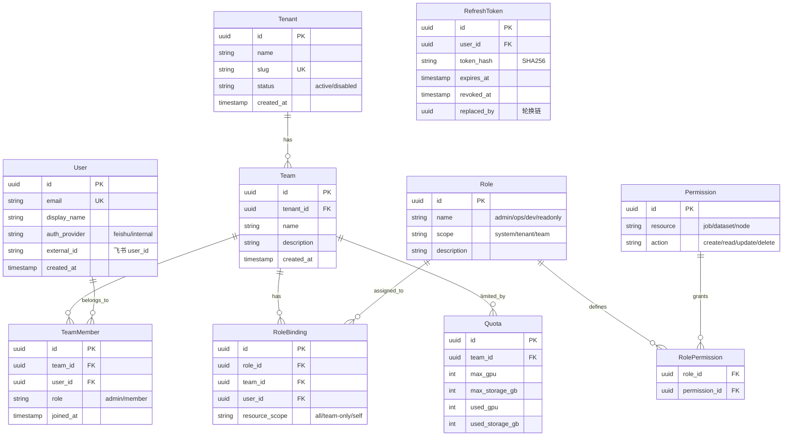
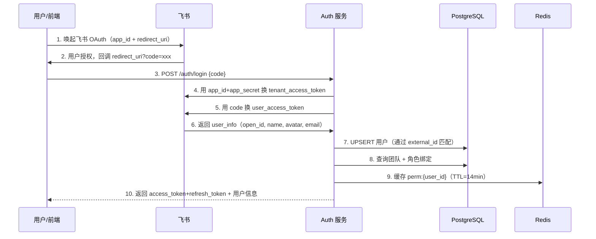
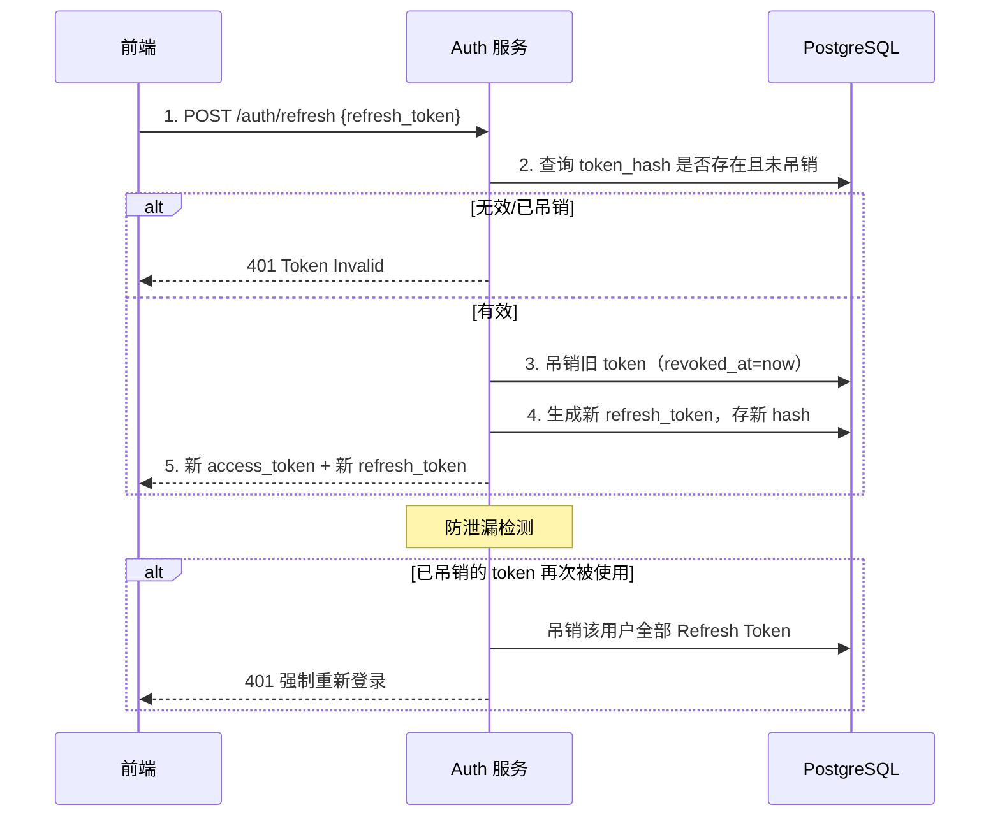
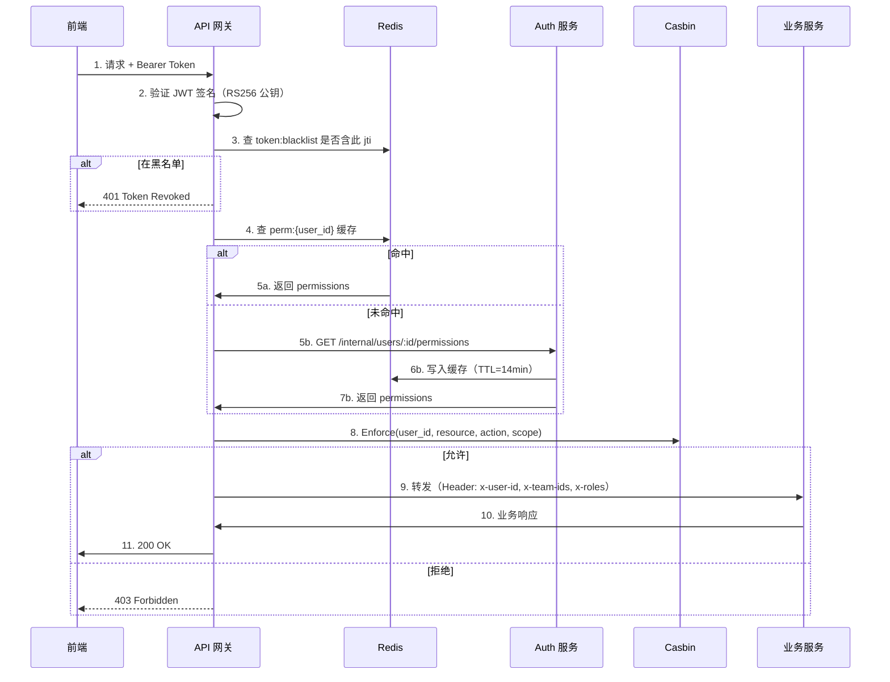
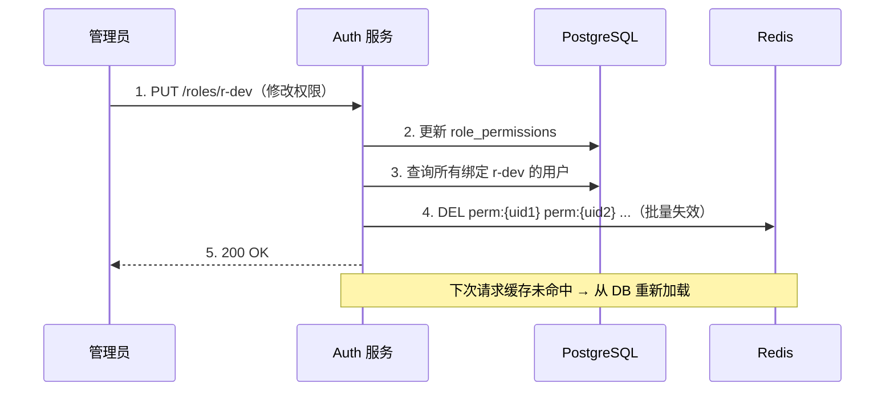

# 技术方案：统一权限中心

> 作者: 架构师
> 日期: 2026-05-25（V2 优化）
> 状态: 定稿
> 关联用户故事: US1.1.1 ~ US1.1.5, US3.1.5

---

## 1. 技术选型

### 1.1 认证方案

| 方案 | 优点 | 缺点 | 结论 |
|------|------|------|------|
| JWT (RS256) | 无状态、跨语言、可内嵌声明 | 无法主动吊销（需黑名单） | ✅ **选用** |
| Session + Redis | 可服务端主动吊销 | 需要中心化存储、水平扩展需共享 Session | ❌ |
| OAuth2 + JWT | 标准授权协议、支持第三方 | 复杂度高、MVP 阶段超重 | ❌ |

**决策理由**：JWT 自包含声明可直接携带角色/权限信息，减少每次请求查库开销。配合短时效 Token（15min）+ Refresh Token（7d 轮换）+ 黑名单机制解决吊销问题。

### 1.2 权限模型

| 方案 | 优点 | 缺点 | 结论 |
|------|------|------|------|
| RBAC (基于角色) | 简单成熟、管理直观 | 细粒度权限需角色数量膨胀 | ✅ **选用（基础）** |
| ABAC (基于属性) | 灵活、支持条件判断 | 评估性能开销大、规则管理复杂 | ❌ MVP 超重 |
| RBAC + Resource Scope | 兼顾简洁与资源级隔离 | 需额外实现 scope 解析器 | ✅ **扩展方案** |

**决策理由**：MVP 阶段 RBAC 足够覆盖。在角色基础上引入 Scope（资源范围）概念约束可操作的数据范围（如"只能查看 teamA 的任务"）。

### 1.3 多租户隔离策略

| 方案 | 优点 | 缺点 | 结论 |
|------|------|------|------|
| 行级别隔离 (tenant_id 列) | 共享 DB、运维简单、成本低 | 需每个 SQL 带租户过滤 | ✅ **选用** |
| Schema 级别隔离 | 数据隔离性好、备份恢复独立 | 连接池膨胀、跨租户查询困难 | ❌ |
| 独立数据库 | 完全隔离、安全性最高 | 成本高、运维复杂 | ❌ |

**决策理由**：行级别隔离满足隔离需求且运维成本最低。
- 每个 Repository 层通过 GORM Scope 自动注入 tenant_id 过滤条件，对应用层透明
- 核心敏感表（配额、角色绑定）额外启用 PostgreSQL Row-Level Security 做安全兜底
- 跨租户查询由平台管理员专属接口处理，需 `scope: system` 角色

### 1.4 技术栈选择

| 组件 | 选型 | 理由 |
|------|------|------|
| 语言/框架 | Go + Gin | 高性能、并发好、生态成熟 |
| 数据库 | PostgreSQL 15+ | JSON 支持灵活存储权限规则，行级 RLS 可做安全兜底 |
| 缓存 | Redis 7+ | Token 黑名单、权限缓存、Refresh Token 存储 |
| 鉴权中间件 | Casbin (RBAC + RESTful Policy) | 成熟、支持动态 policy、Go 原生 |
| ID 生成 | Snowflake (sonyflake) | 分布式 ID，按 tenant 分配 worker ID |

---

## 2. 核心数据模型

### 2.1 ER 图



### 2.2 核心数据结构

```go
type Role struct {
    ID          string       `json:"id" gorm:"type:uuid;primaryKey"`
    Name        string       `json:"name" gorm:"uniqueIndex:idx_role_name_scope"`
    Scope       string       `json:"scope"` // system | tenant | team
    IsPreset    bool         `json:"is_preset"` // 系统预置不可删
    Description string       `json:"description"`
    Permissions []Permission `json:"permissions" gorm:"many2many:role_permissions"`
    CreatedAt   time.Time    `json:"created_at"`
}

type Permission struct {
    ID       string `json:"id" gorm:"type:uuid;primaryKey"`
    Resource string `json:"resource"` // job, node, dataset, user, quota, audit
    Action   string `json:"action"`   // create, read, update, delete, manage
}

type RoleBinding struct {
    ID            string    `json:"id" gorm:"type:uuid;primaryKey"`
    RoleID        string    `json:"role_id" gorm:"index"`
    TeamID        string    `json:"team_id,omitempty" gorm:"index"`
    UserID        string    `json:"user_id" gorm:"index"`
    ResourceScope string    `json:"resource_scope"` // all | team_self | own
    CreatedAt     time.Time `json:"created_at"`
}

type UserPermissionCache struct {
    UserID      string     `json:"sub"`
    TenantID    string     `json:"tenant_id"`
    Teams       []TeamRole `json:"teams"`
    Permissions []string   `json:"permissions"`
    UpdatedAt   int64      `json:"updated_at"`
}

type TeamRole struct {
    TeamID string `json:"id"`
    Role   string `json:"role"`
}
```

### 2.3 预置角色权限矩阵

| 角色 | 任务管理 | 数据集 | GPU 节点 | 用户管理 | 配额管理 | 审计日志 | 适用对象 |
|------|---------|--------|---------|---------|---------|---------|---------|
| admin | CRUD | CRUD | CRUD | CRUD | CRUD | 查看/导出 | 团队负责人 |
| ops | 查看 | 查看 | CRUD | - | 查看 | 查看 | 运维工程师 |
| dev | CRUD(own) | CRUD(team) | 查看 | - | 查看(own) | - | AI 开发者 |
| readonly | 查看 | 查看 | 查看 | - | - | - | 访客/审计 |

---

## 3. API 设计

### 3.1 认证接口

```
POST   /api/v1/auth/login               # 飞书 OAuth2 登录 / 密码登录
POST   /api/v1/auth/refresh             # 刷新 Token（轮换机制）
POST   /api/v1/auth/logout              # 登出（吊销 Refresh Token）
GET    /api/v1/auth/me                  # 当前用户信息 + 权限列表 + 菜单
```

### 3.2 租户/团队管理

```
POST   /api/v1/tenants                  # 创建租户
GET    /api/v1/tenants                  # 租户列表
PUT    /api/v1/tenants/:id              # 更新租户

POST   /api/v1/teams                    # 创建团队
GET    /api/v1/teams                    # 团队列表（按 tenant 过滤）
GET    /api/v1/teams/:id                # 团队详情
PUT    /api/v1/teams/:id                # 更新团队

POST   /api/v1/teams/:id/members       # 添加成员
DELETE /api/v1/teams/:id/members/:uid   # 移除成员
GET    /api/v1/teams/:id/members        # 成员列表
```

### 3.3 角色权限管理

```
POST   /api/v1/roles                    # 创建自定义角色
GET    /api/v1/roles                    # 角色列表
PUT    /api/v1/roles/:id                # 更新角色权限
DELETE /api/v1/roles/:id                # 删除角色（非预置）

POST   /api/v1/role-bindings            # 为用户分配角色
GET    /api/v1/role-bindings            # 查询角色绑定
DELETE /api/v1/role-bindings/:id        # 移除角色绑定
```

### 3.4 配额管理

```
PUT    /api/v1/teams/:id/quota          # 设置配额（管理员）
GET    /api/v1/teams/:id/quota          # 查看配额和使用量
GET    /api/v1/quota/overview           # 全局配额概览
```

### 3.5 关键接口示例

```http
# 飞书登录
POST /api/v1/auth/login
Content-Type: application/json

{
  "auth_provider": "feishu",
  "code": "fetch-from-feishu-oauth"
}

# 响应
{
  "access_token": "eyJhbGciOiJSUzI1NiIs...",
  "expires_in": 900,
  "refresh_token": "dGhpcyBpcyBhIHJlZnJl...",
  "refresh_expires_in": 604800,
  "user": {
    "id": "u-abc123",
    "display_name": "张三",
    "tenant_id": "t-tenant01",
    "teams": [
      {"id": "tm-001", "name": "AI Lab", "role": "admin"}
    ]
  }
}
```

```http
# 权限校验（内部调用）
POST /api/v1/internal/check-permission
Content-Type: application/json

{
  "user_id": "u-abc123",
  "resource": "job",
  "action": "create",
  "context": { "team_id": "tm-001" }
}

# 响应
{
  "allowed": true,
  "reason": ""
}
```

### 3.6 前端菜单动态生成

```
GET /api/v1/auth/me → 响应中包含 menus 字段：

{
  "menus": [
    {
      "name": "任务管理", "path": "/jobs", "icon": "cpu",
      "children": [
        { "name": "任务列表", "path": "/jobs/list" },
        { "name": "创建任务", "path": "/jobs/create", "permission": "job:create" }
      ]
    },
    {
      "name": "集群管理", "path": "/cluster", "permission": "node:read",
      "children": [...]
    }
  ]
}

前端根据 menus 递归渲染侧边栏：
  admin → 全部菜单
  dev   → 只有任务管理 + 只读
  未登录 → 重定向登录页
```

---

## 4. 认证与授权流程

### 4.1 飞书 OAuth 登录



### 4.2 Refresh Token 轮换



### 4.3 请求鉴权（含缓存）



### 4.4 权限变更传播



---

## 5. 模块间契约

### 5.1 对外接口

| 接口 | 协议 | 消费者 | 说明 |
|------|------|--------|------|
| `POST /api/v1/internal/check-permission` | HTTP | 调度引擎、审计、监控 | 权限校验 |
| `GET /api/v1/internal/users/:id/permissions` | HTTP | API 网关 | 权限列表（缓存填充） |
| `GET /api/v1/internal/teams/:id/quota` | HTTP | 调度引擎 | 配额校验 |
| `POST /api/v1/internal/verify-token` | HTTP | 网关（降级） | Token 校验 |
| `POST /api/v1/internal/notify` | HTTP | 各业务服务 | 飞书消息推送 |

### 5.2 JWT 声明

```json
{
  "jti": "unique-token-id",
  "sub": "u-abc123",
  "tenant_id": "t-tenant01",
  "teams": [
    {"id": "tm-001", "role": "admin"},
    {"id": "tm-002", "role": "dev"}
  ],
  "permissions": ["job:create", "job:read", "node:read", "dataset:read"],
  "exp": 1716624000,
  "iat": 1716623100
}
```

### 5.3 错误码

| 错误码 | HTTP | 说明 |
|--------|------|------|
| AUTH_TOKEN_EXPIRED | 401 | Token 过期 |
| AUTH_TOKEN_INVALID | 401 | Token 无效 |
| AUTH_TOKEN_BLACKLISTED | 401 | Token 已吊销 |
| AUTH_TOKEN_REUSE | 401 | Refresh Token 重用（疑似泄漏） |
| AUTH_PERMISSION_DENIED | 403 | 无操作权限 |
| AUTH_QUOTA_EXCEEDED | 403 | 配额不足 |
| AUTH_TENANT_DISABLED | 403 | 租户已禁用 |

---

## 6. 性能与安全

### 6.1 性能考量

| 场景 | 策略 | 预期 |
|------|------|------|
| 权限查询 | Redis 缓存 perm:{user_id} TTL=14min | < 5ms |
| Casbin Policy | 启动全量加载到内存，变更热更新 | < 1ms/enforce |
| 黑名单 | Redis SET，TTL=Token 剩余有效期 | 自动清理 |
| DB 压力 | 读请求优先缓存，连接池 max=50 | < 100 qps 直连 |

### 6.2 安全策略

1. **JWT RS256**：私钥仅 Auth 服务持有，公钥网关缓存，每小时轮换密钥对
2. **Refresh Token 轮换**：每次刷新换新 Token 吊销旧 Token，重用检测强制退出
3. **内部接口**通过 mTLS/Istio 认证，不对外暴露
4. **SQL 注入防护**：GORM Scope 自动注入 tenant_id，禁止手动拼接
5. **敏感操作 MFA**：删除/修改权限、修改配额需飞书消息确认码
6. **Rate Limit**：登录接口 10 次/分钟/IP
7. **飞书凭证**：app_secret 存 Vault/K8s Secret，禁止写入代码

---

## 7. 飞书集成

### 7.1 登录流程

```
1. 前端跳转飞书 OAuth → 用户确认 → 回调携带 code
2. 后端 POST /auth/login {code} 换取 user_access_token
3. 飞书返回 open_id, union_id, name, avatar, email
4. 后端查询/创建用户，返回 JWT
```

### 7.2 用户同步

**定时同步**（CronJob 每 10min）：
1. 调用飞书获取部门列表 API
2. 递归获取部门成员
3. 对比本地 User 表，新增/更新/禁用用户
4. 记录同步日志

**Webhook 实时同步**：
1. 飞书开放平台配置通讯录变更事件订阅
2. 飞书推送 `user_added` / `user_removed` / `dept_changed`
3. Auth 服务接收后增量更新

### 7.3 消息通知

```
POST /api/v1/internal/notify
{
  "type": "message_card",
  "receive_id": "ou_xxx",
  "content": {
    "title": "任务完成",
    "body": "bert-finetune-v3 已完成，耗时 2h 30min",
    "buttons": [
      {"label": "查看详情", "url": "https://platform.internal/tasks/task-xyz789"}
    ]
  }
}

支持类型: 文本、富文本卡片、交互式卡片
```

---

## 8. 种子数据

系统初始化时自动创建：

```sql
-- 预置角色
INSERT INTO roles (id, name, scope, is_preset, description) VALUES
  ('r-admin',    'admin',    'system', true, '平台管理员：完全控制'),
  ('r-ops',      'ops',      'tenant', true, '运维：管理节点和监控'),
  ('r-dev',      'dev',      'team',   true, '开发者：提交任务'),
  ('r-readonly', 'readonly', 'team',   true, '只读用户');

-- 预置 admin 账号
INSERT INTO users (id, email, display_name, auth_provider) VALUES
  ('u-admin', 'admin@platform.local', 'System Admin', 'internal');

INSERT INTO role_bindings (id, role_id, user_id, resource_scope) VALUES
  ('rb-admin', 'r-admin', 'u-admin', 'system');
```

---

## 9. 开发工作量评估

| 模块 | 后端(人天) | 前端(人天) |
|------|-----------|-----------|
| 飞书 OAuth + JWT（含 Refresh Token 轮换） | 3 | 2 |
| 租户/团队管理 CRUD | 2 | 1.5 |
| 角色与权限管理（含 Casbin 集成） | 3 | 2 |
| 角色绑定与分配 | 1.5 | 1 |
| 配额管理 | 2 | 1 |
| 鉴权中间件与网关集成 | 2 | - |
| 权限缓存与失效传播 | 1.5 | - |
| 前端路由权限与菜单过滤 | - | 1.5 |
| 飞书消息通知集成 | 1.5 | - |
| 用户同步（定时 + Webhook） | 2 | - |
| 单元/集成测试 | 2 | 1 |
| **合计** | **20.5** | **10** | **30.5 人天** |
