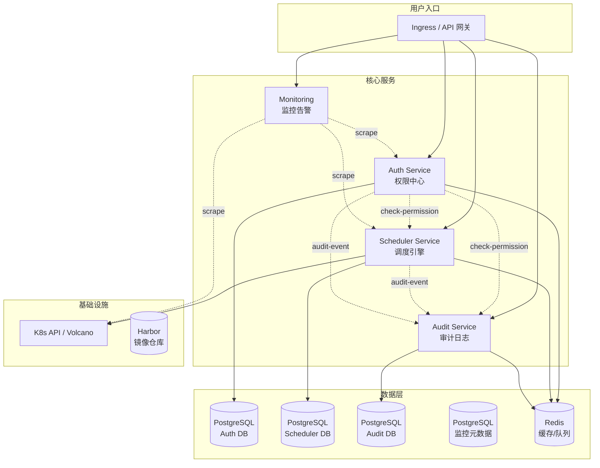
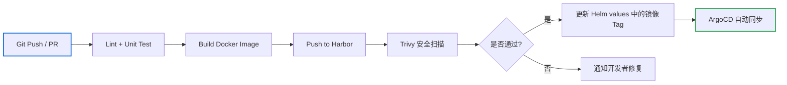

# 技术方案：部署框架

> 作者: 架构师
> 日期: 2026-05-25
> 状态: 初稿
> 关联用户故事: WP4 交付层（部署/CI/CD）

---

## 1. 技术选型

### 1.1 部署编排方案

| 方案 | 优点 | 缺点 | 结论 |
|------|------|------|------|
| **Helm Charts** | K8s 生态标准、参数化配置、版本管理 | Chart 学习成本 | ✅ **选用** |
| Kustomize | 原生 K8s、无需 Tiller | 无模板/无版本管理 | ❌ |
| Docker Compose | 简单、适合单机 | 不支持集群/HPA/服务网格 | ❌ 仅开发环境 |

**决策理由**：Helm 是 K8s 生态事实标准，支持模板化部署、版本回滚、依赖管理。每个子服务一个独立 Chart，通过 umbrella chart 组装。

### 1.2 CI/CD 方案

| 阶段 | 选型 | 理由 |
|------|------|------|
| CI 引擎 | GitHub Actions | 与 GitHub 代码仓库原生集成、生态丰富 |
| 镜像构建 | Docker BuildKit | 支持多阶段构建、缓存加速 |
| 镜像仓库 | Harbor | 私有部署、漏洞扫描、镜像复制 |
| CD 引擎 | ArgoCD (GitOps) | 声明式部署、自动同步、回滚方便 |
| 环境管理 | 3 套 K8s 集群 (dev/staging/prod) | 完全隔离、环境一致 |

### 1.3 基础设施

| 组件 | 选型 | 说明 |
|------|------|------|
| K8s 发行版 | KubeSpray / RKE2 | 生产级、支持 GPU 节点 |
|  Ingress Controller | Traefik / Nginx Ingress | 统一入口 + TLS termination |
| 服务网格 | Istio (可选) | 灰度发布、可观测性、mTLS |
| 日志收集 | Loki + Promtail | 轻量日志聚合 |
| 监控 | Prometheus + Grafana | 指标采集 + 可视化（WP2 范围）|
| GPU 支持 | NVIDIA GPU Operator | 自动部署驱动、device plugin、监控 |

---

## 2. Helm Chart 结构

### 2.1 整体结构

```
charts/
├── Chart.yaml                    # Umbrella chart
├── values.yaml                   # 全局配置
├── requirements.yaml             # 子 chart 依赖
│
├── auth-service/                 # 权限中心服务
│   ├── Chart.yaml
│   ├── values.yaml
│   ├── templates/
│   │   ├── deployment.yaml
│   │   ├── service.yaml
│   │   ├── ingress.yaml
│   │   ├── configmap.yaml
│   │   ├── secret.yaml
│   │   ├── hpa.yaml
│   │   └── _helpers.tpl
│   └── tests/
│
├── scheduler-service/            # 调度引擎服务
│   ├── Chart.yaml
│   ├── values.yaml
│   ├── templates/
│   │   ├── deployment.yaml
│   │   ├── service.yaml
│   │   ├── configmap.yaml
│   │   └── ... (同 auth-service)
│   └── tests/
│
├── audit-service/                # 审计日志服务
│   ├── Chart.yaml
│   ├── values.yaml
│   ├── templates/
│   │   └── ... (同上)
│   └── tests/
│
├── monitoring/                   # 监控栈（Grafana/Prometheus）
│   ├── Chart.yaml
│   ├── values.yaml
│   └── templates/
│
└── common/                       # 共享模板
    └── templates/
        ├── _helpers.tpl          # 通用 label/name helpers
        └── _pod.tpl              # 通用 pod 模板
```

### 2.2 模块化部署策略

| 场景 | 部署命令 | 说明 |
|------|---------|------|
| 完整平台 | `helm install ai-platform ./charts` | 部署所有服务 |
| 子服务独立 | `helm install auth ./charts/auth-service` | 仅部署权限中心 |
| 指定环境 | `helm install ... -f values-prod.yaml` | 环境差异化覆盖 |
| 增量更新 | `helm upgrade auth ./charts/auth-service` | 仅更新 Auth 服务 |

### 2.3 Service 间调用关系



---

## 3. CI/CD 流水线

### 3.1 CI 流水线



### 3.2 分支策略

```
main
  ├── develop
  │    ├── feature/auth-rbac
  │    ├── feature/scheduler-queue
  │    └── feature/audit-log
  └── release/v1.0.0
       ├── hotfix/critical-bug
       └── hotfix/security-patch
```

| 分支 | 用途 | 部署目标 | 自动部署 |
|------|------|---------|---------|
| feature/* | 功能开发 | 无 | 否 |
| develop | 开发集成 | dev K8s | CI 自动部署 |
| release/* | 发布候选 | staging K8s | 手动触发 |
| main | 生产就绪 | prod K8s | ArgoCD 自动同步 |

### 3.3 环境配置管理

```
configs/
├── base/                          # 基础配置
│   ├── auth-service.yaml
│   ├── scheduler-service.yaml
│   └── audit-service.yaml
├── dev/                           # 开发环境覆盖
│   ├── values.yaml
│   └── secrets.yaml               # 仅占位，实际用 Sealed Secrets
├── staging/                       # 预发布环境覆盖
│   ├── values.yaml
│   └── secrets.yaml
└── prod/                          # 生产环境覆盖
    ├── values.yaml
    └── secrets.yaml
```

**配置差异示例：**

| 配置项 | dev | staging | prod |
|--------|-----|---------|------|
| 副本数 | 1 | 2 | 3-5 (HPA) |
| 日志级别 | debug | info | warn |
| 数据库连接 | dev 实例 | staging 实例 | 生产 RDS 集群 |
| GPU 模拟 | 启用模拟 | 真实 GPU | 真实 GPU |
| 镜像 Tag | develop-latest | release-* | semantic-version |

---

## 4. 差异化配置管理

### 4.1 Helm values 文件策略

```yaml
# values.yaml (全局默认)
global:
  environment: dev
  imageRegistry: harbor.internal
  imagePullPolicy: IfNotPresent

auth-service:
  replicas: 1
  image:
    tag: latest
  resources:
    requests:
      cpu: 100m
      memory: 128Mi
    limits:
      cpu: 500m
      memory: 512Mi
  config:
    logLevel: debug
    jwtExpiryMin: 15
    refreshTokenExpiryDays: 7
  ingress:
    enabled: true
    host: auth.dev.internal

scheduler-service:
  replicas: 1
  config:
    pollIntervalSec: 5
    maxTaskRuntimeDays: 7

audit-service:
  replicas: 1
  config:
    exportMaxRows: 100000
```

```yaml
# values-prod.yaml (生产环境覆盖)
global:
  environment: prod

auth-service:
  replicas: 3
  image:
    tag: v1.0.0
  resources:
    requests:
      cpu: 200m
      memory: 256Mi
    limits:
      cpu: 1
      memory: 1Gi
  config:
    logLevel: warn
  autoscaling:
    enabled: true
    minReplicas: 3
    maxReplicas: 10
    targetCPUUtilizationPercentage: 70

scheduler-service:
  replicas: 2
  resources:
    requests:
      cpu: 500m
      memory: 512Mi
```

### 4.2 密钥管理

```
方案选型: Sealed Secrets (Bitnami)
  - 密钥在 Git 中加密存储（SealedSecret CRD）
  - 只有 K8s 集群内的 Sealed Secrets Controller 可解密
  - 支持环境隔离：dev/staging/prod 各自密钥不可互解

示例：
 加密前 (secret.yaml)    → 加密后 (sealed-secret.yaml)
  DB_PASSWORD: "xxx"      →  AgBKmX3... (base64)
```

### 4.3 数据库迁移策略

```
方案：
  - 每个服务独立管理自己的数据库 Schema
  - 使用 golang-migrate / goose 作为迁移工具
  - 迁移脚本存储在 services/<name>/migrations/

流程：
  1. 新部署 → Init Container 运行 migrate up
  2. 回滚 → 运行 migrate down（需手动确认）
  3. 迁移文件不可修改（只追加）

迁移文件示例：
  auth-service/migrations/
    000001_create_tenants.up.sql
    000001_create_tenants.down.sql
    000002_create_roles.up.sql
    000002_create_roles.down.sql
```

---

## 5. 备份与灾难恢复

### 5.1 数据库备份策略

| 备份类型 | 周期 | 保留时间 | 存储位置 |
|---------|------|---------|---------|
| PostgreSQL 全量备份 | 每日 03:00 | 30 天 | 对象存储 (S3/MinIO) |
| WAL 归档 | 连续 | 7 天 | 对象存储 (S3/MinIO) |
| Redis RDB 快照 | 每小时 | 24 小时 | 本地 + S3 |
| ES 快照 | 每日 04:00 | 7 天 | 对象存储 (S3/MinIO) |

```yaml
# PostgreSQL 备份方案：pgBackRest
# 部署方式：K8s CronJob
apiVersion: batch/v1
kind: CronJob
metadata:
  name: pg-backup
spec:
  schedule: "0 3 * * *"
  jobTemplate:
    spec:
      template:
        spec:
          containers:
            - name: pgbackrest
              image: pgbackrest/pgbackrest:latest
              command:
                - pgbackrest
                - --stanza=ai-platform
                - --type=full
                - backup
              env:
                - name: PGBACKREST_PG1_PATH
                  value: /var/lib/postgresql/data
                - name: PGBACKREST_REPO1_S3_BUCKET
                  value: ai-platform-backup
                - name: PGBACKREST_REPO1_S3_REGION
                  value: us-east-1
                - name: PGBACKREST_REPO1_S3_ENDPOINT
                  value: s3.internal
```

### 5.2 灾难恢复 RTO/RPO

| 故障场景 | RTO (恢复时间目标) | RPO (恢复点目标) | 恢复方式 |
|---------|-------------------|-----------------|---------|
| Pod 崩溃 | < 30s | 0 | K8s 自动重启 |
| 节点故障 | < 5min | 0 | Pod 自动迁移 |
| 数据库故障（单机） | < 30min | < 1h | WAL 回放恢复 |
| 数据库故障（HA） | < 10s | 0 | 自动主从切换 |
| 集群级故障 | < 4h | < 24h | 从 S3 恢复全量备份 + WAL |
| 区域级故障 | < 24h | < 1h | 跨区域恢复 |

### 5.3 数据库主从架构

```mermaid
flowchart TB
    subgraph "K8s 集群"
        PG-P[PostgreSQL Primary\n读写端点: pg-primary:5432]
        PG-S1[PostgreSQL Standby-1\n只读端点: pg-standby:5432]
        PG-S2[PostgreSQL Standby-2\n异步复制]
        PG-P -->|同步复制| PG-S1
        PG-P -.->|异步复制| PG-S2
        PATRONI[Patroni\n自动故障切换]
    end

    subgraph "对象存储"
        S3[(S3/MinIO\n备份存储)]
    end

    PG-P -->|pgBackRest\n每日全量| S3
    PG-S1 -->|WAL 连续归档| S3
    PATRONI -->|健康检测| PG-P
    PATRONI -->|健康检测| PG-S1

    Note over PG-P,PG-S2: 故障切换：Patroni 检测到 Primary 宕机后提升 Standby-1 为新的 Primary
```

---

## 6. NVIDIA GPU Operator 集成

### 6.1 GPU Operator 组件

NVIDIA GPU Operator 自动管理 GPU 节点的驱动、运行时和监控：

```
gpu-operator/
├── nvidia-driver-daemonset    # 自动安装 GPU 驱动
├── nvidia-container-toolkit   # Docker/containerd 运行时配置
├── nvidia-device-plugin       # K8s device plugin（暴露 nvidia.com/gpu）
├── nvidia-dcgm-exporter       # GPU 指标暴露（Prometheus）
├── gpu-feature-discovery      # 自动标记节点 GPU 标签
└── mig-manager                # MIG 设备管理
```

### 6.2 Helm 部署配置

```bash
# 安装 GPU Operator
helm install gpu-operator nvidia/gpu-operator \
  --namespace gpu-operator \
  --create-namespace \
  --set driver.enabled=true \
  --set driver.version="535" \
  --set toolkit.enabled=true \
  --set devicePlugin.enabled=true \
  --set dcgmExporter.enabled=true \
  --set migManager.enabled=true
```

### 6.3 GPU 节点标签

GPU Operator 自动为节点添加以下标签，供调度器筛选：

```yaml
# 节点自动标签示例
labels:
  nvidia.com/gpu.present: "true"
  nvidia.com/gpu.count: "8"
  nvidia.com/gpu.memory: "81920"
  nvidia.com/gpu.product: "A100-SXM4-80GB"
  nvidia.com/cuda.driver.major: "535"
  nvidia.com/gpu.compute.major: "8"
  nvidia.com/gpu.compute.minor: "0"
```

### 6.4 监控集成

DCGM Exporter 暴露的 Prometheus 指标：

| 指标名 | 说明 | 用途 |
|--------|------|------|
| `DCGM_FI_DEV_GPU_UTIL` | GPU 利用率 % | 利用率监控 |
| `DCGM_FI_DEV_MEM_COPY_UTIL` | 显存带宽利用率 % | 性能分析 |
| `DCGM_FI_DEV_TEMP` | GPU 温度 ℃ | 过热告警 |
| `DCGM_FI_DEV_POWER_USAGE` | GPU 功率 W | 功耗监控 |
| `DCGM_FI_DEV_FB_USED` | 显存使用量 MB | 显存监控 |
| `DCGM_FI_DEV_GPU_TEMP` | GPU 温度 | 温度告警 |

---

## 7. 升级与回滚策略

### 7.1 升级流程

```
1. 修改代码 → PR → CI 通过 → 合并到 develop
2. GitHub Actions 构建新镜像并推送到 Harbor（tag: git-sha）
3. 更新 Helm values 中的镜像 tag
4. ArgoCD 检测到 Git 变化，自动同步到 dev 环境
5. 验证通过后，手动更新 staging 环境 values
6. 验证通过后，创建 release PR 到 main
7. ArgoCD 自动同步到 prod（金丝雀 10% → 30% → 100%）
```

### 7.2 回滚策略

| 回滚场景 | 方式 | 操作 |
|---------|------|------|
| 代码回滚 | Git revert + ArgoCD 同步 | `git revert HEAD` → git push → ArgoCD 自动同步 |
| Helm 回滚 | Helm rollback | `helm rollback <release> <revision>` |
| 数据库回滚 | goose down | `goose down`（需手动确认）|
| 配置回滚 | Git revert values 文件 | 恢复上一版本配置 |

```bash
# Helm 回滚命令
helm rollback auth-service 2                # 回滚到 revision 2
helm history auth-service                   # 查看历史版本
helm rollback auth-service 2 --wait --timeout 5m

# 数据库回滚
cd services/auth/migrations
goose down                                   # 回滚一步
goose status                                 # 检查迁移状态
```

### 7.3 回滚原则

1. **数据库迁移不可逆操作需人工审批**（如 DROP COLUMN、数据清理）
2. **回滚顺序**：先回滚代码，再回滚数据库（如需）
3. **重大变更**（Schema 变更、API 不兼容）：提前一个版本废弃（Deprecate），下一版本移除
4. **回滚后**：必须验证数据完整性，执行两次读比较

---

## 8. 可观测性

### 8.1 日志规范

所有服务遵循统一日志格式（JSON）：

```json
{
  "timestamp": "2026-05-25T10:00:00.123Z",
  "level": "info",
  "service": "auth-service",
  "trace_id": "trace-xxx",
  "message": "user login success",
  "extra": {
    "user_id": "u-abc123",
    "tenant_id": "t-tenant01"
  }
}
```

### 8.2 健康检查

每个服务必须暴露以下端点：

| 端点 | 用途 | 预期返回 |
|------|------|---------|
| `GET /healthz` | Liveness Probe | 200 OK |
| `GET /readyz` | Readiness Probe | 200 OK（含 DB/Redis 连接检查）|
| `GET /metrics` | Prometheus 指标采集 | Prometheus 格式 |
| `GET /info` | 服务版本信息 | 服务名 + 版本 + commit |

### 8.3 资源规格建议

| 服务 | dev | staging | prod (HPA) | GPU 需求 |
|------|-----|---------|------------|---------|
| auth-service | 1C/512MB x1 | 2C/1GB x2 | 2C/1GB x3-10 | 无 |
| scheduler-service | 2C/1GB x1 | 4C/2GB x2 | 4C/4GB x3-8 | 无 (管理面) |
| audit-service | 1C/512MB x1 | 2C/1GB x2 | 2C/2GB x3-6 | 无 |
| 数据库 (PG) | 2C/4GB x1 | 4C/8GB x1 | 8C/32GB HA x3 | 无 |
| Redis | 1C/2GB x1 | 2C/4GB x1 | 4C/16GB Cluster | 无 |

---

## 9. 开发工作量评估

| 模块 | 后端/DevOps(人天) | 说明 |
|------|------------------|------|
| Helm Chart 框架搭建 | 3 | Umbrella + 子 Chart 结构 |
| Auth 服务 Chart | 1.5 | |
| Scheduler 服务 Chart | 1.5 | 含 Volcano CRD 配置 |
| Audit 服务 Chart | 1 | |
| CI 流水线 (GitHub Actions) | 2 | 镜像构建 + 安全扫描 |
| CD 流水线 (ArgoCD) | 2 | GitOps 配置 |
| 数据库迁移框架 | 1 | |
| 密钥管理 (Sealed Secrets) | 1 | |
| GPU Operator 集成 | 1.5 | 驱动 + device plugin + DCGM |
| 备份恢复方案 | 2 | pgBackRest + CronJob + 恢复演练 |
| 环境配置 (dev/staging/prod) | 1.5 | |
| 文档与运行手册 | 1 | |
| **合计** | **19** | |
